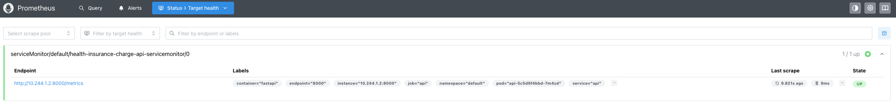
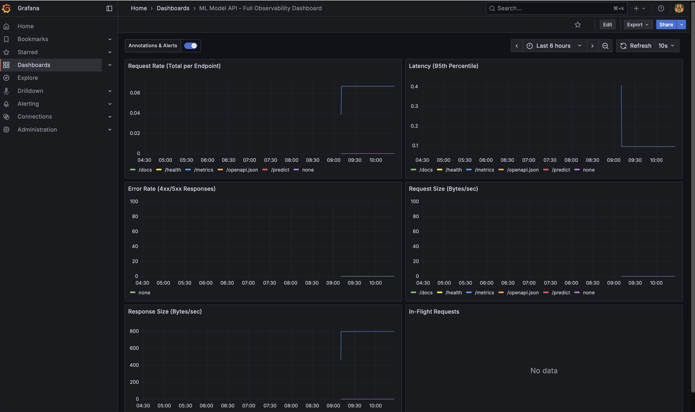
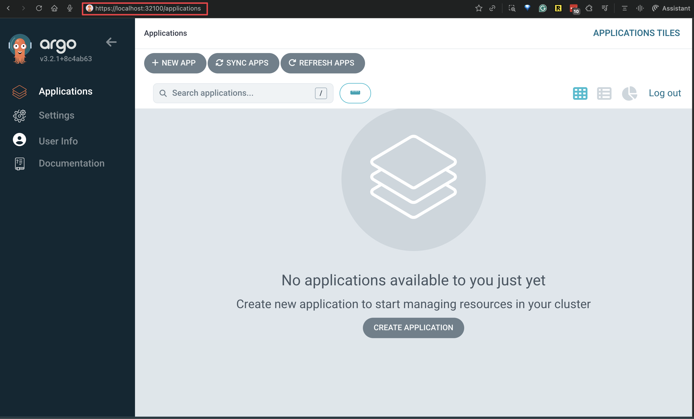

# MLOps Health Insurance Project

A Machine Learning Operations (MLOps) project for predicting health insurances charges. The overall context of the data is covering the 4 US regions. This project demonstrates the end-to-end workflow of building, deploying, and monitoring a machine learning model using modern MLOps practices. It includes data preprocessing, model training, model deployment, experiment tracking using tools like MLflow, FastAPI (API development), Streamlit (frontend UI), Prometheus and Grafana (monitoring). There are two main components in this project:

1. **Backend API**: A FastAPI application that serves the machine learning model for predictions.
2. **Frontend UI**: A Streamlit application that provides a user-friendly interface for interacting with the model.


https://github.com/user-attachments/assets/222f500c-3c44-4e32-abea-6ea15a12228c


## Setup & Installation

<details open><summary><h3>Directory structure</h3></summary>

```
.
├── configs
│   └── model_config.yaml
├── data
│   ├── interim
│   │   └── cleaned_health_insurance_us_v1.csv
│   ├── processed
│   │   └── clean_feature_process_ordinal_health_insurance_us_v1.csv
│   └── raw
│       └── health-insurance-us.csv
├── deployment
│   ├── kubernetes
│   │   ├── fastapi-model-deploy.yaml       # FastAPI deployment configuration
│   │   ├── fastapi-model-svc.yaml          # FastAPI service configuration
│   │   ├── fastapi-scaledobject.yaml       # KEDA ScaledObject configuration for FastAPI deployment
│   │   ├── kind-three-node-cluster.yaml    # KIND configuration file to create a local k8s cluster with 3 nodes
│   │   ├── kustomization.yaml              # Kustomize configuration file to run required k8s manifests
│   │   ├── streamlit-deploy.yaml           # Streamlit deployment configuration
│   │   └── streamlit-svc.yaml              # Streamlit service configuration
│   ├── mlflow
│   │   └── mlflow-docker-compose.yaml
│   └── monitoring
│       ├── fastapi-scaledobject.yaml
│       ├── model-vpa.yaml
│       ├── predict.json
│       └── servicemonitor.yaml
├── docker-compose.yml                      # Docker Compose file to run both FastAPI and Streamlit apps
├── Dockerfile.api                          # Dockerfile for FastAPI backend
├── Dockerfile.streamlit                    # Dockerfile for Streamlit frontend
├── environment.yml
├── main.py
├── models
│   └── trained
│       ├── insurance_charges_model_xgbregressor.pkl # Trained model object defined here
│       └── preprocessor_ordinal_clean.pkl           # Preprocessor object defined here
├── notebooks
│   ├── 01_data_engineering.ipynb
│   ├── 02_eda.ipynb
│   ├── 03_feature_engineering.ipynb
│   └── 04_model_experiment_eval.ipynb
├── pyproject.toml                          # Project configuration file
├── README.md
├── setup_env.sh
├── src
│   ├── api                                 # FastAPI backend application
│   │   ├── __init__.py
│   │   ├── inference.py
│   │   ├── main.py
│   │   └── schemas.py
│   ├── data    
│   │   ├── __init__.py
│   │   └── run_processing.py
│   ├── features
│   │   ├── __init__.py
│   │   └── engineer.py                    # Feature engineering scripts
│   └── models
│       ├── __init__.py
│       └── train_model.py                 # Model training scripts 
├── streamlit_app                          # Streamlit frontend application
│   ├── __init__.py
│   └── app.py
└── uv.lock                                # Dependency lock file
```
</details>

**Prerequisites:**

- Python 3.12 or higher
- `uv` is recommended for running the app(s) locally
- Docker & Docker Compose is the recommended approach for containerization and specific deployment scenarios like mlflow server - see below for details
- Kubernetes is optional for container orchestration, followed with KIND for local cluster setup to run the application in a Kubernetes environment
    - Helm is optional but recommended for managing Kubernetes applications concerning continous monitoring (Prometheus & Grafana)
    - ArgoCD is optional for GitOps-based continuous deployment in Kubernetes environments

### App Access

#### Local python environment setup

Install python project dependencies in a virtual environment in the following way:

```bash
$ python -m venv .venv && source .venv/bin/activate
$ pip install -e .
```

You can use uv in the following way to install dependencies in a virtual environment - if you haven't installed uv already, you can visit the docs [here](https://docs.astral.sh/uv/getting-started/installation/). Otherwise create your virtual environment in uv like so

```bash
$ uv venv && source .venv/bin/activate
$ uv sync
$ uv pip install -e .
```

**Environment Variables Configuration**

For local development, you need to configure environment variables to connect the Streamlit frontend to the FastAPI backend:

```bash
# Create your local .env file from the example template
$ cp .env_example .env
```

The `.env` file configures:
- `API_ENDPOINT=http://localhost:8000` - Points Streamlit to your local FastAPI server
- `APP_VERSION=2.0.0` - Application version displayed in the UI

**Note**: The `.env` file is for local development only. When running with Docker Compose or Kubernetes, environment variables are configured in `docker-compose.yml` or Kubernetes manifests respectively (see below for further details).

**Running the Applications**

You should then be able to run both the FastAPI backend and Streamlit frontend applications locally by activating the virtual environment and running the respective commands like so:

```bash
# Run FastAPI backend (in first terminal)
$ fastapi run src/api/main.py

# Run Streamlit frontend (in second terminal)
$ streamlit run streamlit_app/app.py
```

Test the api `/predict` endpoint using curl or Postman:

```bash
$ curl -X POST "http://localhost:8000/predict" -H "Content-Type: application/json" -d @deployment/monitoring/predict.json
$ # Sample response - time in UTC  
{"predicted_charge":7620.43,"prediction_time":"2025-10-31 --- 21:38:17"}
```

Although optional the preprocessor and model files are already included in the repository. For validation purposes, you can generate the feature engineered dataset and applied transformations by running feature engineering pipeline:

```bash
$ python src/features/engineer.py \
  --input data/interim/cleaned_health_insurance_us_v1.csv \
  --output data/processed/clean_feature_process_ordinal_health_insurance_us_v1.csv \
  --preprocessor models/trained/preprocessor_ordinal_clean.pkl \
  --encoding ordinal
```

#### Docker & Docker Compose (Recommended)

You can also run both applications using Docker Compose. This method is recommended as it simplifies the setup process by containerizing and simultaneously running both the FastAPI backend and Streamlit frontend. Instructions for install docker and docker compose can be found [here](https://docs.docker.com/get-docker/) and [here](https://docs.docker.com/compose/install/).

```bash
# Build and run both FastAPI and Streamlit apps using Docker Compose in the background
$ docker compose -f docker-compose.yml up --build -d
```

Test the api `/predict` endpoint using curl or Postman:

```bash
$ curl -X POST "http://localhost:8000/predict" -H "Content-Type: application/json" -d @deployment/monitoring/predict.json
$ # Sample response - time in UTC  
{"predicted_charge":7620.43,"prediction_time":"2025-10-31 --- 21:38:17"}
```

Open your browser and navigate to `http://localhost:8501` to access the Streamlit frontend application.

```bash
# stop both containers
$ docker compose -f docker-compose.yml down
```

**Running Feature Engineering and Experiment Tracking with MLflow Tracking:** 

Although optional the preprocessor and model files are already included in the repository. For validation purposes, you can generate the feature engineered dataset, applied transformations, and tracked experiments by running feature engineering pipeline and model training with MLflow tracking server using Docker Compose:

```bash
# 1. Start MLflow server in background
$ docker compose -f deployment/mlflow/mlflow-docker-compose.yaml up -d

# 2. Verify MLflow is running (should see "mlflow-tracking-server")
$ docker ps

# 3. Run feature engineering from your local environment
$ python src/features/engineer.py \
  --input data/interim/cleaned_health_insurance_us_v1.csv \
  --output data/processed/clean_feature_process_ordinal_health_insurance_us_v1.csv \
  --preprocessor models/trained/preprocessor_ordinal_clean.pkl \
  --encoding ordinal

# 4. Train model and register model experiment with MLflow tracking from your local environment
$ python src/models/train_model.py \
  --config configs/model_config.yaml \
  --data data/processed/clean_feature_process_ordinal_health_insurance_us_v1.csv \
  --models-dir models/ \
  --mlflow-tracking-uri http://localhost:5555

# 5. View experiments in MLflow UI
# Open http://localhost:5555 in your browser

# 6. Stop MLflow when done
$ docker compose -f deployment/mlflow/mlflow-docker-compose.yaml down
```

#### Kubernetes Deployment (Optional)

You can deploy the applications to a Kubernetes cluster. For local testing, you can use KIND to create a local Kubernetes cluster. Although advanced and optional, this method is useful for simulating a production-like environment.

**Prerequisites:**

Before starting, ensure you have the following tools installed:

- **Docker**: For running containers ([Installation Guide](https://docs.docker.com/get-docker/))
- **KIND** (Kubernetes in Docker): For local Kubernetes cluster ([Installation Guide](https://kind.sigs.k8s.io/docs/user/quick-start/#installation))
- **kubectl**: Kubernetes command-line tool ([Installation Guide](https://kubernetes.io/docs/tasks/tools/))
- **Kustomize**: For deploying Kubernetes manifests - built into kubectl 1.14+, or install standalone ([Installation Guide](https://kubectl.docs.kubernetes.io/installation/kustomize/))
- **Helm** (Optional): For installing monitoring tools ([Installation Guide](https://helm.sh/docs/intro/install/))

**Step 1: Create KIND Cluster**

Create a local 3-node Kubernetes cluster (1 control plane, 2 workers) using the provided configuration:

```bash
# Create cluster from configuration file
$ kind create cluster --name health-insurance-mlops --config deployment/kubernetes/kind-three-node-cluster.yaml

# Verify cluster was created
$ kind get clusters
# Expected output: health-insurance-mlops

# Check Docker containers are running
$ docker ps --filter "name=health-insurance-mlops"
# Expected output: 3 containers (1 control-plane, 2 worker nodes)

# Verify kubectl context is set correctly
$ kubectl config current-context
# Expected output: kind-health-insurance-mlops

# If context is not set, switch to it
$ kubectl config use-context kind-health-insurance-mlops

# Verify cluster is accessible
$ kubectl cluster-info --context kind-health-insurance-mlops
# Expected output: Kubernetes control plane is running at https://127.0.0.1:XXXXX

# Check all nodes are ready
$ kubectl get nodes
# Expected output: 3 nodes (1 control-plane, 2 worker) with STATUS=Ready
```

**Step 2: Deploy Application with Kustomize**

Deploy the FastAPI backend and Streamlit frontend using Kustomize:

```bash
# Deploy all resources (deployments, services)
$ kubectl apply -k deployment/kubernetes/

# Verify deployment setup is successful
$ kubectl get all
# Expected output: Pods, Services, Deployments for FastAPI and Streamlit should be running  
```

**Note:** Autoscaling (KEDA ScaledObject) is not deployed in this step. It will be configured in Step 4 after KEDA is installed.

**Step 3: Access the Applications**

Once all pods are running, access the applications:

- **Streamlit UI**: http://localhost:30000
- **FastAPI API Health Check**: http://localhost:30100/health
- **FastAPI Documentation**: http://localhost:30100/docs

Test the API with a prediction request:

```bash
$ curl -X POST "http://localhost:30100/predict" \
  -H "Content-Type: application/json" \
  -d @deployment/monitoring/predict.json

# Expected response:
{"predicted_charge":7620.43,"prediction_time":"2025-10-31 --- 21:38:17"}
```

**Step 4: Install KEDA for Horizontal Autoscaling (Optional)**

KEDA enables metric-based autoscaling for the FastAPI deployment. The application will scale from 1 to 5 replicas based on API latency and request rate:

```bash
# Add KEDA Helm repository
$ helm repo add kedacore https://kedacore.github.io/charts && helm repo update

# Install KEDA operator
$ helm install keda kedacore/keda --namespace keda --create-namespace

# Verify KEDA is running
$ kubectl get pods -n keda

# Deploy the ScaledObject for FastAPI autoscaling
$ kubectl apply -f deployment/monitoring/fastapi-scaledobject.yaml

# Verify ScaledObject is created
$ kubectl get scaledobject
```

**Step 5: Install Prometheus & Grafana for Monitoring (Optional)**

Install the kube-prometheus-stack to monitor your application metrics using NodePort services:

```bash
# Add Prometheus community Helm repository
$ helm repo add prometheus-community https://prometheus-community.github.io/helm-charts && helm repo update

# Install Prometheus stack with NodePort services in monitoring namespace
$ helm upgrade --install prom \
  -n monitoring \
  --create-namespace \
  prometheus-community/kube-prometheus-stack \
  --set grafana.service.type=NodePort \
  --set grafana.service.nodePort=30200 \
  --set prometheus.service.type=NodePort \
  --set prometheus.service.nodePort=30300 \
  --set prometheus.prometheusSpec.serviceMonitorSelectorNilUsesHelmValues=false \
  --set grafana.adminPassword=prom-operator

# Verify Helm release is deployed
$ helm list -A

# Verify all monitoring resources are running
$ kubectl get all -n monitoring

# Verify Prometheus stack pods are running
$ kubectl get pods -n monitoring

# Deploy ServiceMonitor to scrape FastAPI metrics
$ kubectl apply -f deployment/monitoring/servicemonitor.yaml
```

**Access the monitoring UIs:**

- **Prometheus**: http://localhost:30300
- **Grafana**: http://localhost:30200
  - Username: `admin`
  - Password: `prom-operator`

**Validate Monitoring Setup**

Validate from Prometheus that the metrics are being sent to prometheus
http://localhost:30300/targets



Also running queries in Prometheus UI to see if metrics are being collected:

```promql
http_requests_total

histogram_quantile(0.95, sum(rate(http_request_duration_seconds_bucket [1m])) by (le, handler))

rate(http_request_size_bytes_sum[1m])
```

You can then create Grafana dashboards to visualize these metrics. Login to Grafana and setup in the following way:

- Dashboard → New -> Import
- In the box which appears as `Import via dashboard JSON model` paste the code from this [gist](https://gist.githubusercontent.com/initcron/ca57251c80bc2f4a2adde0a878ebc585/raw/f6fb4304ebb026725c8c4d0e54c37d87ae64cafb/enhanced_fastapi_ml_dashboard.json), paste and click on Load

The dashboard should look like this:



This provides the monitoring which is specific to model's performance in terms of latency, number of requests, error rates etc. which could be very useful for you to scale your inference later.

**What's being monitored:**
- FastAPI metrics exposed at `/metrics` endpoint (scraped every 15s)
- KEDA autoscaling triggers based on:
  - API latency (P95 threshold: 0.08 seconds)
  - Request rate (threshold: 20 requests/minute)

**Step 6: Install Vertical Pod Autoscaler (Optional)**

VPA automatically adjusts CPU and memory requests/limits for optimal resource usage:

```bash
# Install VPA using the official repository
$ git clone https://github.com/kubernetes/autoscaler.git && cd autoscaler/vertical-pod-autoscaler && ./hack/vpa-up.sh && rm -rf ../../autoscaler && cd -

# Deploy VPA for the FastAPI deployment
$ kubectl apply -f deployment/monitoring/model-vpa.yaml

# Check VPA recommendations
$ kubectl describe vpa model-vpa
```

**Step 7: Install ArgoCD for GitOps Deployment (Optional)**

ArgoCD provides declarative, GitOps-based continuous deployment:

```bash
# Create ArgoCD namespace
$ kubectl create namespace argocd

# Install ArgoCD
$ kubectl apply -n argocd -f https://raw.githubusercontent.com/argoproj/argo-cd/stable/manifests/install.yaml`

# Wait for ArgoCD to be ready
$ kubectl wait --for=condition=available --timeout=600s deployment/argocd-server -n argocd

# Reset admin password to password 
# bcrypt(password)=$2a$10$rRyBsGSHK6.uc8fntPwVIuLVHgsAhAX7TcdrqW/RADU0uh7CaChLa
kubectl -n argocd patch secret argocd-secret \
  -p '{"stringData": {
    "admin.password": "$2a$10$rRyBsGSHK6.uc8fntPwVIuLVHgsAhAX7TcdrqW/RADU0uh7CaChLa",
    "admin.passwordMtime": "'$(date +%FT%T%Z)'"
  }}'

# Verify ArgoCD is running
$ kubectl get all -n argocd

# Expose ArgoCD server as NodePort
$ kubectl patch svc argocd-server -n argocd --patch \
  '{"spec": { "type": "NodePort", "ports": [ { "nodePort": 32100, "port": 443, "protocol": "TCP", "targetPort": 8080 } ] } }'

# Verify ArgoCD server is exposed as NodePort
$ kubectl get svc -n argocd
# NAME          TYPE     CLUSTER-IP      EXTERNAL-IP   PORT(S)
# .............
# argocd-server NodePort 10.96.211.174   <none>        80:31773/TCP,443:32100/TCP


# Access ArgoCD UI in your browser - bypassing HTTPS certificate verification
$ open https://localhost:32100/
# Username: admin
# Password: password
```

Verify ArgoCD UI is running after logging in with the username and password:



**Using ArgoCD for GitOps Deployment**

Once ArgoCD is installed, configure an application via the ArgoCD UI with the following settings:

| Setting | Value |
|---------|-------|
| Application Name | `healthinsuranceml` |
| Project | `default` |
| Repository URL | `https://github.com/<your-username>/mlops-health-insurance-proj.git` |
| Revision | `release` (or `main`) |
| Path | `deployment/kubernetes` |
| Cluster URL | `https://kubernetes.default.svc` |
| Namespace | `default` |
| Sync Policy | Automatic (with Prune and Self-Heal enabled) |

The GitOps workflow operates as follows:

1. **Make changes** to Kubernetes manifests in `deployment/kubernetes/`
2. **Commit and push** changes to the `release` branch
3. **ArgoCD auto-syncs** within ~3 minutes (or click "Refresh" in UI)
4. **Verify** deployment status shows "Synced" and "Healthy"

To manually trigger a sync:

```bash
# Using ArgoCD CLI (optional - install from https://argo-cd.readthedocs.io/en/stable/cli_installation/)
$ argocd app sync healthinsuranceml

# Or use the "SYNC" button in ArgoCD UI at https://localhost:32100
```

To test the GitOps workflow:

```bash
# 1. Make a change (e.g., update replica count in streamlit-deploy.yaml)
# 2. Commit and push to release branch
$ git add deployment/kubernetes/streamlit-deploy.yaml
$ git commit -m "Update streamlit replicas"
$ git push origin release

# 3. Watch ArgoCD sync the change automatically in the UI
```


### How to use

### Testing 

### References

The following resources were instrumental in the development of this project:

