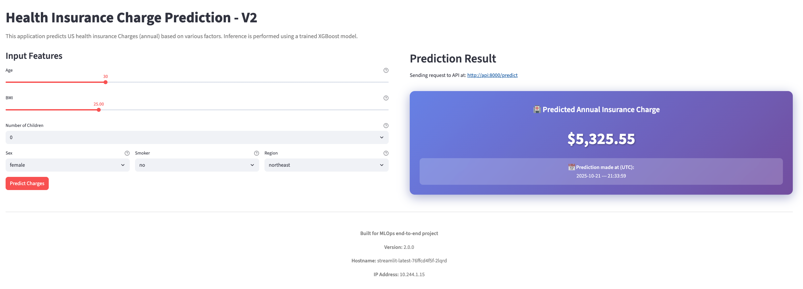

# MLOps Health Insurance Project

A Machine Learning Operations (MLOps) project for predicting health insurances charges. The overall context of the data is covering the 4 US regions. This project demonstrates the end-to-end workflow of building, deploying, and monitoring a machine learning model using modern MLOps practices. It includes data preprocessing, model training, model deployment, experiment tracking using tools like MLflow, FastAPI (API development), Streamlit (frontend UI), Prometheus and Grafana (monitoring). There are two main components in this project:

1. **Backend API**: A FastAPI application that serves the machine learning model for predictions.
2. **Frontend UI**: A Streamlit application that provides a user-friendly interface for interacting with the model.

    

## Setup & Installation

<details open><summary><h3>Directory structure</h3></summary>

```
.
├── configs
│   └── model_config.yaml
├── data
│   ├── interim
│   │   └── cleaned_health_insurance_us_v1.csv
│   ├── processed
│   │   └── clean_feature_process_ordinal_health_insurance_us_v1.csv
│   └── raw
│       └── health-insurance-us.csv
├── deployment
│   ├── kubernetes
│   │   ├── fastapi-model-deploy.yaml       # FastAPI deployment configuration
│   │   ├── fastapi-model-svc.yaml          # FastAPI service configuration
│   │   ├── fastapi-scaledobject.yaml       # KEDA ScaledObject configuration for FastAPI deployment
│   │   ├── kind-three-node-cluster.yaml    # KIND configuration file to create a local k8s cluster with 3 nodes
│   │   ├── kustomization.yaml              # Kustomize configuration file to run required k8s manifests
│   │   ├── streamlit-deploy.yaml           # Streamlit deployment configuration
│   │   └── streamlit-svc.yaml              # Streamlit service configuration
│   ├── mlflow
│   │   └── mlflow-docker-compose.yaml
│   └── monitoring
│       ├── fastapi-scaledobject.yaml
│       ├── model-vpa.yaml
│       ├── predict.json
│       └── servicemonitor.yaml
├── docker-compose.yml                      # Docker Compose file to run both FastAPI and Streamlit apps
├── Dockerfile.api                          # Dockerfile for FastAPI backend
├── Dockerfile.streamlit                    # Dockerfile for Streamlit frontend
├── environment.yml
├── main.py
├── models
│   └── trained
│       ├── insurance_charges_model_xgbregressor.pkl # Trained model object defined here
│       └── preprocessor_ordinal_clean.pkl           # Preprocessor object defined here
├── notebooks
│   ├── 01_data_engineering.ipynb
│   ├── 02_eda.ipynb
│   ├── 03_feature_engineering.ipynb
│   └── 04_model_experiment_eval.ipynb
├── pyproject.toml                          # Project configuration file
├── README.md
├── setup_env.sh
├── src
│   ├── api                                 # FastAPI backend application
│   │   ├── __init__.py
│   │   ├── inference.py
│   │   ├── main.py
│   │   └── schemas.py
│   ├── data    
│   │   ├── __init__.py
│   │   └── run_processing.py
│   ├── features
│   │   ├── __init__.py
│   │   └── engineer.py                    # Feature engineering scripts
│   └── models
│       ├── __init__.py
│       └── train_model.py                 # Model training scripts 
├── streamlit_app                          # Streamlit frontend application
│   ├── __init__.py
│   └── app.py
└── uv.lock                                # Dependency lock file
```
</details>

**Prerequisites:**

- Python 3.12 or higher
- `uv` is recommended for running the app(s) locally
- Docker & Docker Compose is the recommended approach for containerization and specific deployment scenarios like mlflow server - see below for details
- Kubernetes is optional for container orchestration, followed with KIND for local cluster setup to run the application in a Kubernetes environment
    - Helm is optional but recommended for managing Kubernetes applications concerning continous monitoring (Prometheus & Grafana)
    - ArgoCD is optional for GitOps-based continuous deployment in Kubernetes environments

### App Access

#### Local python environment setup

Install python project dependencies in a virtual environment in the following way:

```bash
$ python -m venv .venv && source .venv/bin/activate
$ pip install -e .
```

You can use uv in the following way to install dependencies in a virtual environment - if you haven't installed uv already, you can visit the docs [here](https://docs.astral.sh/uv/getting-started/installation/). Otherwise create your virtual environment in uv like so

```bash
$ uv venv && source .venv/bin/activate
$ uv sync
$ uv pip install -e .
```

**Environment Variables Configuration**

For local development, you need to configure environment variables to connect the Streamlit frontend to the FastAPI backend:

```bash
# Create your local .env file from the example template
$ cp .env.example .env
```

The `.env` file configures:
- `API_ENDPOINT=http://localhost:8000` - Points Streamlit to your local FastAPI server
- `APP_VERSION=2.0.0` - Application version displayed in the UI

**Note**: The `.env` file is for local development only. When running with Docker Compose or Kubernetes, environment variables are configured in `docker-compose.yml` or Kubernetes manifests respectively (see below for further details).

**Running the Applications**

You should then be able to run both the FastAPI backend and Streamlit frontend applications locally by activating the virtual environment and running the respective commands like so:

```bash
# Run FastAPI backend (in first terminal)
$ fastapi run src/api/main.py

# Run Streamlit frontend (in second terminal)
$ streamlit run streamlit_app/app.py
```

Test the api `/predict` endpoint using curl or Postman:

```bash
$ curl -X POST "http://localhost:8000/predict" -H "Content-Type: application/json" -d @deployment/monitoring/predict.json
$ # Sample response - time in UTC  
{"predicted_charge":7620.43,"prediction_time":"2025-10-31 --- 21:38:17"}
```

#### Docker & Docker Compose (Recommended)

You can also run both applications using Docker Compose. This method is recommended as it simplifies the setup process by containerizing and simultaneously running both the FastAPI backend and Streamlit frontend.

```bash
# Build and run both FastAPI and Streamlit apps using Docker Compose
$ docker-compose up --build
```

Test the api `/predict` endpoint using curl or Postman:

```bash
$ curl -X POST "http://localhost:8000/predict" -H "Content-Type: application/json" -d @deployment/monitoring/predict.json
$ # Sample response - time in UTC  
{"predicted_charge":7620.43,"prediction_time":"2025-10-31 --- 21:38:17"}
```

### How to use

### Testing 

### References
